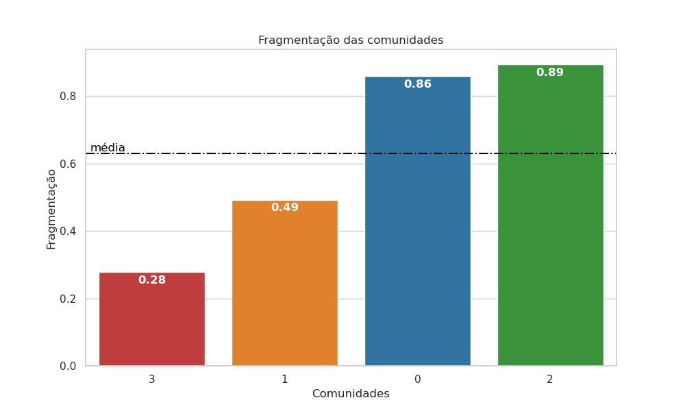
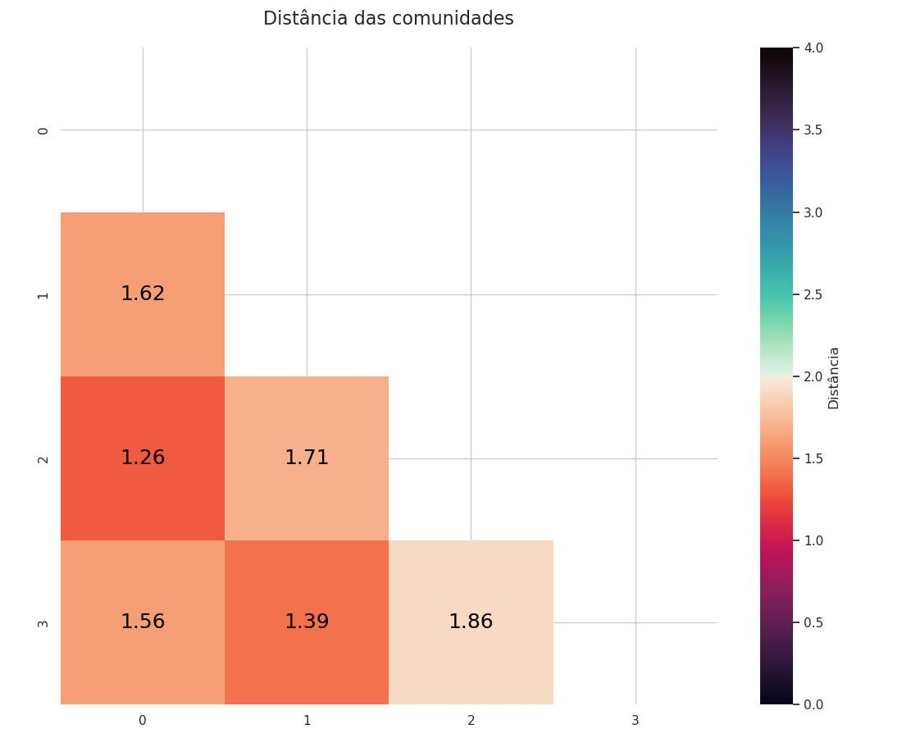
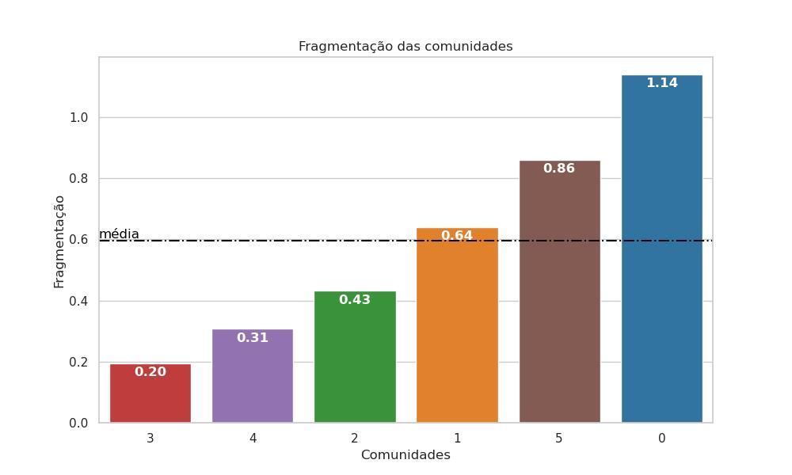
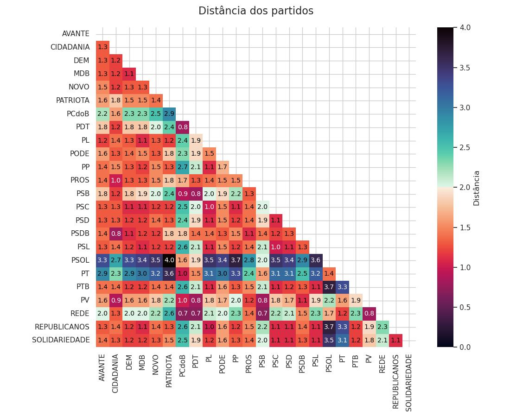

Esse Jupyter Notebook é para realizar a análise das redes de deputados e reconhecer padrões que possam ser explicados e entendidos pelos resumos dos discursos. Esses padrões podem explicar a movimentação política de partidos e/ou espectro políticos inteiros.  

Três tipos de análises serão feitas:  
- __Análise Qualitativa__: Uma análise visual dos plots das redes de deputados, será feita para pré identificação de padrões em destaque para direcionar a próxima análise;
- __Análise Quantitativa__: Uma análise numérica dos dados da rede para comprovar(ou não) as hipóteses da primeira análise;
- __Análise Textual__: Uma análise dos resumos gerados pelo LLM para compreender os padrões encontrados nas análise anteriores dando significado e causa para padrões identificados.

As duas primeiras análises serão prcurarão identificar Partidos e Comunidades __"Em Destaque"__: 
- Partidos de um mesmo espectro político ou posição em relação ao governo que estão visualmente e/ou numéricamente distantes ou isolados;
- Comunidades diferentes que representam um mesmo espectropolítico ou posição ao governo. 

Além disso será feita uma análise cronológica identificando aproximações e/ou isolamento de partidos, fusão e/ou surgimento de novas comunidades

# Análise preliminar da quantidade de votações

Com um Total de 3076 votações coletadas entre 2019 e 2024 vemos que o ano de 2021 tem muito mais votações que os demais anos. Isso pode se dar ao período de maior gravidade da pandêmia e o surgimento de diversas medididas, escandalos e investigações sendo feitas. Uma análise com recorte temporal maior pode comprovar melhor a hipótese.

> Imagem 1: Gráfico do total de votações

# Contextualização da posição do governo no período

> Imagem 2: Contexto político

O período de 2019 a 2024 consistem em um período marcado por dois governos, um de direita(Bolsonaro) e um de Esquerda(PT). Até metade do governo Bolsonaro a Direita se mantém na Presidência da Câmara, a partir desse momento a Centro Direita assume essa posição.
O periodo contém dois períodos de posse e um ano eleitoral, que influenciam a organização e parcerias partidárias. Além disso foi um período marcado pela Pandêmia de COVID-19 que chacoalhou o cenário político brasieliro. 

# Análises Anuais

## 2019

> Imagem 3: Partidos 2019

Olhando os partidos na Imagem 3 se ve claramente uma distribuição entre partidos do bloco Governista e partidos do Bloco. O Bloco de Oposição aparenta estar mais coêso que o bloco Governista. O Bloco Governista aparenta ter duas regiões mais densas, uma aparentemente formada pelo PSL e NOVO e a outra formada por demais partidos de Direita e Centro.

> Imagem 4: Comunidades 2019

Olhando a rede na Imagem 4 pela comunidades claramente ve-se a organização dita ateriormente, com duas comunidades no Bloco Governista e uma comunidade no Bloco de Oposição. Também podemos ver um possível artefato.

|     |   Deputados por partido |   % Partido na Comunidade |   Isolamento |
|:----|------------------------:|--------------------------:|-------------:|
| PSL |                       3 |                      6.38 |            0 |

Os números ajudam a ver com mais detalhes as comunidades. A comunidade 3 aparenta ainda mais ser um artefato, já que ela possui apenas 3 deputados (0.7%).

> Imagem 5: Isolamento das Comunidades de 2019

> Imagem 6: Fragmentação das Comunidades de 2019

Dito isso, uma das comunidades(1) representa todo o bloco de oposição já que o executivo se posicionava a direita([aqui](analise.md#contextualização-da-posição-do-governo-no-período)). Essa comunidade tem 139(32,8%) deputados, formada principalmente pelo PT, PSB, PDT, PSOL e PCdoB. A Imagem 6 mostra que ela tem uma fragmentação de 0.49, a mais baixa se desconsiderar-se o artefato. O que mostra que a comunidade é mais coesa que as outras. Na Imagem 5 se vê que a comunidade tem 0.52 de isolamento, o mais alto das 4 o que é de se esperar por representar toda a oposição.

Além dessa, existem outras duas comunidades uma de 192 deputados e uma de 88. A primeira(2) é a maior comunidade, ela é composta principalmente pelo PL, PSD, PP MDB, Republicanos, PSDB, DEM, PTB e Soliedaridade, partidos de direita e centro, o que mostra que essa comunidade compõe o bloco governista. Na imagem 6 pode se observar que sua fragmentação é de 0.89, a maior fragmentação, o que é compreensivel já que é a maior comunidade da rede e possui muitos partidos que a compõem. Já o isolamento, Imagem 5, é de 0.43, levente abaixo da média.

Já a última comunidade(0), a menor comunidade, se desconsiderar a comunidade artefato, é formada principalmente pelo PSL(50% da comunidade), NOVO, CIDADANIA, PODE e alguns membros do PSDB. Na Imagem 6 se vê que sua fragmentação é de 0.86, muito próxima da comunidade 2. Isso se deve porque a comunidade têm varias deputados dos principais partidos da comunidade 2, um pouco mais de 10%. Já na Imagem 5 pode ser visto que seu isolamento é de 0.35, o menor de todos e bem abaixo da média. Isso mostra um comportamento mais conciliador da comunidade, umas vez que o principal partido da comunidade é o partido do atual executivo, tentando contruir essa boa relação com demais deputasdos, contudo, isso acontece mais com partidos de direita, já que a distância entre a comunidade 0 e 2 é a menor de todas com 1.26, como pode ser visto na Imagem 7. Isso demonstra como ambas as comunidades compõem o bloco Governista. A dúvida é o que tanto se difere do comportamento desses deputados para que o bloco governista se dividisse em duas comunidas?

> Imagem 7: Distancia das comunidades

Indo para a analise dos discursos obtem-se as resposta para o questionamento e mais detalhes que comprovam as hipóteses. Conforme o Anexo 3, a comunidade 2 defendeu a PEC 98/2019, reforma da previdência, e a PEC 187/2019, que tinha carater de austeridade fiscal nos discursos de seus deputados. Defendeu a exploração dos recursos na Amazônia e o porte de armas de agricultores para a resolução de problemas no campo. Além disso, demonstrou desconfiança com a esqurda, repudiou o PL 2269/2015 que defendia a reformulação da definição de família, e criticou a atuação do executivo, o que pode ser uma explicação para o distanciamento com a comunidade 0. 
  
Já no Anexo 1 a comunidade 0 manteve seu discurso no entorno da austeridade fiscal e tributário, além da defesa da liberdade de expressão, o que mostra um leve distanciamento das pautas da comunidade 2, além disso defendeu em seus discursos o apio ao governo para melhor governabilidade, o que explica a comunidade 0 ter o menor isolamento, tentanto uma postura um pouco mais conciliadora.

Quando se lê o Anexo 4, a comunidade 3, que aparentava ser um artefato, percebe-se que o discurso fica em torno de pautas critãs e conservadoras em relação a família, além da liberdade de expressão. Como a comunidade têm apenas 3 deputados os resumos podem não ser tão representativos em relação aos votos dos candidatos, mas já da pistas de que a comunidade realmente não seja um artefato, validando mais ainda a escolha do algoritmo de detecção de comunidades.

Porfim, percebe-se no Anexo 2 que a comunidade 1 defende a proteção do meio ambiente e biodiversidade e o combate a queimada e o desmatamento. Defendeu a proteção dos povos indígenas e demarcação de terras, Além da c'ritica a Reforma Tributária. Pautas bem opostas as demais comunidades, explicando o isolamento da comunidade ser o mais alto da rede.

Vale ressaltar que existem alguns pontos em comum entre as comunidades, o que 

# 2020

> Imagem 8: Partidos 2020

Analisando a rede da Imagem 8 se ve os partidos organizados entre o bloco Governista e o bloco da Oposição. O bloco da oposição desta vez se mostra desoeso entre si mas coeso em seus sub grupos, formando duas regiões uma com o PT e o PSOL e uma com PSB, PCdoB e PDT. Quando se olha o bloco Governista els se organizam em uma grande região pouco coesa, com excessão do NOVO que se encontra bem coeso dentro da regiã. Além disso é possivel ver uma concentração do PSDB numa região mais ao centro do espetro. 

> Imagem 9: Partidos 2020

Quando se olha as comunidades na Imagem 9 os palpites se comprovam: o bloco governista em uma unica comunidade, enquanto o bloco da oposição se encontra em três comunidades, uma mais o centro, e uma mais a esquerda do espectro Além disso pode-se ver mais dois possiveis artefatos, uma no centro e uma isolada na região governista.

| |2019|2020|
|:--|--:|--:|
|distância média| 1.272 | 1.737 |

Comparado com o ano de 2019, a rede de 2020 tem uma distância média bem maior, um aumento de 36,6% esse impacto é perceptívelna distancia entre os partidos que teve um desvio padrão duas vezes maior.

> Imagem 10: Isolamento das Comunidades de 2020

> Imagem 11: Fragmentação das Comunidades de 2020

Indo para as comunidades, 4 grandes comunidades de 2 possiveis artefatos. Dessas, a comunidade 0 representa o bloco Governista, com 288 deputados, uma comunidade gigantesca com 66.67% dos deputados do ano de 2020. Composta pelo PSL, PP, REPUBLICANOS, PSDB, PL, PSD, DEM, MDB, SOLIEDARIEDADE, NOVO, CIDADANIA, PTB, PSC, PATRIOTA. No gráfico da Imagem 11, a comunidade tem um a fragmentação de 1.14, a maior de todas as comunidades, o que é compreensível devido ao seu tamanho. Já na Imagem 10 vemos que a comunidade tem um isolamento de 0.9, o segundo maior, compreensivel uma vez que é uma comunidade da ponta do expectro, representando o bloco governista.

> Imagem 12: Isolamento dentro da comunidade 0 comparado com Fragmentação na rede

Quando se olha a Imagem 12 vê se partidos com isolamento levemente maior( por volta de 1.3), demonstrando que, mesmo dentro de uma mesma comunidade e votando em conjunto, alguns partidos votam levemente diferente em relação aos demais. Quando soma-se isso a uma análise da fragmentação dos partidos que compões esse grupo, alguns desses partidos com isolamento mais alto tem uma fragmentação bem baixa formando "panelinhas"(isolamento acima da média e fragmentação abaixo da média) dentro da comunidades. Esse partdidos são o PSDB, NOVO E CIDADANIA. Analisando o Isolamento desses partidos, o PSDB e o CIDADANIA tem as os dois menores isolamentos da rede, mostrando uma posição mais concialiadora em relação a comunidade 0, enquanto o NOVO tem o terceiro maior isolamento dos partidos quer compõem a comunidade 0, mostrando uma posição mais radical em relação a rede. Os resumos podem confirmar isso?

Próximo a 0 existe a comunidade 4 que aparenta ser um artefato, possui apenas 3 deputados do partido PODE, representando 33% da composição do partidos e 0.69% da rede. 

|      |   Deputados por partido |   % Partido na Comunidade |
|:-----|------------------------:|--------------------------:|
| PODE |                       3 |                     33.33 |

Indo mais ao centro, existe a comunidade 2, uma comunidade pequena, de 20 deputados, 4.63%, composta por alguns deputados da esquerda - alguns membros do PSB, PDT e PV - e alguns membros da direita - um membros do AVANTE, PODE, PSD, PSDB, PL e PSL - além disso, alguns partidos pequenos tem mais de 50% de seus mebros nessa rede, partidos como PROS e o PV. É uma rede com uma fragemntação abaixo da média com 0.43 e seu isolamento é de 0.39 o mais baixo de todos, compreensivel uma vez que é uma comunidade que representa o centro do espectro político.

Levemente ligada a comunidade 2 tem a 3, outra comunidade que aparenta ser um artefato com 4 deputados de partidos diferentes.

|      |   Deputados por partido |   % Partido na Comunidade |
|:-----|------------------------:|--------------------------:|
| MDB  |                       1 |                      4.55 |
| PL   |                       1 |                      3.57 |
| PODE |                       1 |                     11.11 |
| PP   |                       1 |                      3.12 |

Chegando a Esquerda do espectro, existem 2 comunidades, a comunidade 1, mais ao centro e a 5 mais a esquerda. A comunidade 1 é média com 58 deputados, 13.42% da comunidade. A comunidade é formada pelo PDT, boa parte do PSB e todo o PCdoB. É uma comunidade com isolamento de 0.67 e, abaixo da média, o que é compreensível devido a posição mais ao centro, mesmo que a esquerda. Já sua fragmentação é de 0.64, bem próximo da média. Por fim a comunidade 5 é uma comunidade 5 também é média, com 59% dos deputados da rede, 13.66% formada por 100% do PT e do PSOL. A comunidade tem um isolamento 1.04, o maior dentro as demais, o que mostra uma posição mais extrema. Já sua fragmentação é de 0.86, bem acima da média e a segunda maior. Quando se olha pro isolamento interno, isso se torna compreensível uma vez que os partdios tem 1.42 de isolamento entre si. Isso é expresso na distância dos partidos na Imagem 13: o PT esta mais próximo do PCdoB, que está na comuniddade 1, do que o PSOL, que esta na própria comunidade.

> Imagem 13: Distancia dos partidos dentro da rede de 2020

> Imagem 14: Fragmenatção dos partidos em 2020

E quando se olha para a fragmentação desses partidos na Imagem 14, o PSOL tem a mais baixa da rede, 0.59, e o PT uma das mais baixas, 0.69, mostrando que os partidos são coesos, mas se distanciam, podendo até dizer que eles poderiam ser de outra comunidade. levando isso em conta, o que descoesinou tanto o campo da oposição para formar duas comunidades, e o que diferencia tanto o PSOl do PT?

Indo para os resumos, no Anexo 5 a comunidaade 0 defende a defesa da Reforma da Previdência e da redução da inflação e a abertura do mercado brasileiro ao comércio estrangeiro como medidas mais liberais, além disso defende a necessidade de descentralização do poder e atribuição de responsabilidade às entidades locais e descentralização de recursos para os estados e municípios, o que evidencia a estratégia de lidar com a pandemia de forma descentralizada. Além disso, crítica ao aumento do salário mínimo, sugerindo que o aumento do salário mínimo pode gerar exclusão social e que a liberdade e as trocas voluntárias são mais importantes para o crescimento econômico e geração de empregos e, porfim, crítica à postura do Presidente Bolsonaro e à falta de comprometimento com a formação de um pacto nacional para combater a pandemia, o que mostra o isolamento do executivo ao sair do PLS. Quando olhamos pros partidos destacados anteriormente nos anexos 11, 12 e 13. O PSDB e o CIDADANIA defendem uma intervenção para conter a pandemia, o que entre em contraste com a defesa da liberdade e resposabilidade de gestores do locais do resto da comunidade. Já o partido NOVO uma menor intervenção do Estado na econômia, o que difere a comunidade conter os gastos e a divida pública. Comprovando as hipóteses apresentadas anteriormente.

A comunidade 4, anexo 9, Apoia o FUNDEB. Mas pouco conclusiva para dizer que náo é um artefato, já que muito do quer foi resumido não se refere a situação nacional. Analise conclusiva apenas analisando a proposições votadas.

Olahndo o anexo 7, a comunidade 2 foca em defender os idosos e população vulneravel durante a pandemia, além de defenderem a reforma da previdência.  Tendo uma posição bem ao centro do espectro, como a própria comunidade.

Comunidade 3 não têm nada conclusivo, defendem um projeto especifico de escopo local.

Indo pro lado da oposição, olhando o anexo 6, a comunidade 1 Defende a Reforma do FUNDEB, proteção da vida da população. Defesa dos servidores públicos. Proteção da economia e gerar empregos. Além disse diversas críticas ao Governo Bolsonaro e sua gestão da pandemia e por ir contra a orientações da OMS, além decríticas relacionadas a valorização da ditadura millitar. 

Por fim, olhando o anexo 10, a comunidade 5 defende a valorização do salário mínimo e educação pública gratuita, laica e de qualidade, proteção da Amazônia e do meio ambiente, posições em oposição as açoes do executivo na época. Defende garantir a renda para as pessoas afetadas pela pandemia, manutenção do auxílio emergencial em pelo menos R$ 600 e discussão de uma renda básica para dar dignidade ao povo brasileiro, posição em contraste as demais comunidades. Critica ao entreguismo bolsonarista e apoio às classes mais pobres e a privatização sem autorização da PETROBRAS é uma ameaça à soberania do Brasil. Priorização de recursos para a iniciativa privada, crítica bem forte a politica economica de direita. Além da crítica a nomeação de militares para cargos em agências reguladoras. Olhando para mais internamente na rede e analisando os anexos 14 e 15, ve- se diferenás claras entre o PT e o PSOL. Enquanto o PSOL defende de forma incisiva as politicas do atual governo como:

> - A política ambiental do governo Bolsonaro foi considerada destrutiva e que visa trucidar a Amazônia brasileira.
> - A medida provisória que visa regular a pandemia de COVID-19 nos portos brasileiros foi criticada por priorizar os interesses das empresas.
> - A redução do valor do auxílio emergencial foi criticada como uma política assassina e irresponsável.
> - A política de entrega de empresas públicas para o capital estrangeiro foi criticada como uma lógica de subserviência e de retirada dos direitos dos trabalhadores mais pobres.

o PT fica numa posição menos incisiva, um pouco mais próximo do posicionamento da comunidade 1, porém com propostas mais próximas do PSOL:
> - Defesa da proteção do Sistema Único de Saúde (SUS) e dos direitos sociais e políticos dos brasileiros;
> - Necessidade de medidas emergenciais para enfrentar a crise causada pela pandemia de COVID-19;
> - Defesa da renda básica emergencial como uma medida crucial para atender às necessidades de milhões de brasileiros;

Isso concretiza a distancia que os partidos tem dentro da própria comunidade.

# Anexos

## Anexo 1: Sumarização da comunidade 0 de 2019

Resumo Combinado dos Discursos de Deputados Federal General Peternelli e Alex Manente, Paulo Eduardo Martins, Bia Kicis, Eduardo Barbosa e Lourival Gomes, e Paula Belmonte, Guiga Peixoto, Geovania de Sá e Léo Motta, Antônio Furtado, Célio Silveira, Diego Garcia e Rogério Peninha Mendonça, e Vinicius Poit e Aline Gurgel, Alexandre Frota e Eros Biondini:

**Pontos Favoráveis**

- Austeridade e anticorrupção são fundamentais para o desenvolvimento do Brasil, garantindo a segurança jurídica e o investimento em serviços essenciais.
- Transparência e comunicação pública são essenciais para garantir a segurança jurídica e o investimento em serviços essenciais.
- Combate à violência contra os motoristas de Uber é importante para garantir a segurança pública e proteger os direitos dos trabalhadores.
- Redução da dívida interna e privatização podem contribuir para o desenvolvimento econômico do Brasil, garantindo a estabilidade financeira do país.
- Importância da classificação de documentos para garantir a segurança e a privacidade dos cidadãos.
- Exploração da riqueza mineral da Amazônia de forma responsável, respeitando os direitos dos índios e protegendo as áreas de preservação ambiental.
- Combate à discriminação e ao preconceito que cercam as pessoas com autismo.
- Defesa da liberdade de expressão e da combate à oligarquia.

**Críticas**

- Falta de gestão eficaz por parte dos governos locais, contribuindo para a falta de desenvolvimento em algumas regiões.
- Dificuldade em desenvolver a cidade de São Bernardo do Campo, devido à falta de investimentos e políticas públicas eficazes.
- Acesso descontrolado ao medicamento canabidiol, que pode ter consequências negativas para a saúde pública.
- Falta de transparência em atos administrativos públicos, o que pode levar a desconfiança e descontentamento dos cidadãos.
- Falta de metas claras para o saneamento básico, o que pode contribuir para a falta de investimentos em infraestrutura.
- Condenação à ideologia de gênero como uma alucinação perversa.
- Crítica à falta de atenção ao caso da "marolinha" do movimento político que ocorreu na sexta-feira.
- Falta de responsabilidade dos governos locais em relação à gestão de serviços públicos.

**Opiniões em Comum**

- Combater a corrupção e promover a transparência nas políticas públicas.
- Garantir a proteção das mulheres e das crianças.
- Defesa da educação, saúde e ambiente adequado.
- Mudanças políticas e sociais para melhorar a vida do povo brasileiro.
- Combate à discriminação e ao preconceito que cercam as pessoas com autismo.
- Importância de combater a corrupção e a pobreza no Brasil.
- Necessidade de unir-se e apoiar o Governo para superar as dificuldades.
- Defesa da liberdade de expressão e da combate à oligarquia.

**Diferenças**

- Vinicius Poit e Alexandre Frota criticam as empresas Anglo American e Zamin Ferrous, enquanto os outros discursos não mencionam essas empresas.
- Vinicius Poit e Aline Gurgel criticam a falta de atenção da sociedade a problemas de segurança pública e políticas públicas, enquanto os outros discursos não mencionam esses pontos.
- Eros Biondini defende a implementação do modelo de APACs em todo o Brasil e a promoção da recuperação e reintegração social dos presos, enquanto os outros discursos não mencionam essa questão.

Em resumo, os discursos de todos os deputados concordam em combater a corrupção e a pobreza, promover a transparência e a liberdade de expressão, e garantir a proteção das mulheres e das crianças. No entanto, há diferenças em suas opiniões sobre questões específicas, como a política de saúde do governo, a falta de responsabilidade dos governos locais e a implementação do modelo de APACs.

## Anexo 2: Sumarização da comunidade 1 de 2019

Resumo Combinado dos Discursos dos Deputados

Pontos Favoráveis:

*   Proteção do meio ambiente e preservação da biodiversidade.
*   Proteção dos povos indígenas e demarcação de suas terras.
*   Democracia e justiça social.
*   Investir em educação pública e luta dos professores e professoras.
*   Proteger o meio ambiente.
*   Valorizar a vida e combater o suicídio.
*   Promover a diversificação da economia.
*   Garantir a transparência e a eficiência na gestão pública.
*   Garantir benefícios fiscais concedidos a igrejas, instituições beneficentes e Santas Casas de Misericórdia.
*   Abertura da participação do capital estrangeiro nas empresas aéreas.
*   Regulamentação do benefício de incentivos no ICMS para igrejas, instituições filantrópicas e a Santa Casa de Misericórdia.
*   Aumentar o rigor da Lei Maria da Penha para prevenir o feminicídio.
*   Introduzir dispositivos nos artigos 12 e 18 da Lei Maria da Penha para prevenir o feminicídio.
*   Permitir que autoridades policiais ordenem a apreensão de armas de fogo no momento da ocorrência de violência contra a mulher.
*   Criação de uma frente parlamentar para combater o suicídio.
*   Defesa da criação de instâncias para monitorar a aplicação de recursos para a educação infantil.

Críticas:

*   Crítica ao Ministro Abraham e defesa de políticas públicas para os trabalhadores.
*   Crítica ao governo Bolsonaro e defesa de descriminalização das drogas.
*   Crítica à reforma da Previdência e defesa de manutenção do pagamento de acréscimo pelo trabalho aos domingos.
*   Crítica à emenda que visa reorganizar o prazo de recursos e julgamento.
*   Desvinculação dos recursos do FUNDEB.
*   Falta de apoio do governo a projetos que buscam investir em educação.
*   Desenvolvimento para o País.
*   Privilégios para os professores.
*   Falta de desenvolvimento para a educação infantil.
*   Falta de transparência do governo em relação à reforma da Previdência.
*   Obstrução dos partidos que podem prejudicar instituições que já tinham benefícios anteriores.
*   Decisão do Tribunal de Justiça do Rio de Janeiro de privar os ex-Governadores Anthony e Rosinha Garotinho de sua liberdade.

Opiniões em Comum:

*   Democracia e justiça social.
*   Importância de investimentos em saúde e agilizar o processo de reforma agrária.
*   Proteção dos povos indígenas e demarcação de suas terras.
*   Combate ao desmatamento e queimadas na Amazônia.
*   Proteção da liberdade religiosa e responsabilização penal.
*   Vidigal expressa orgulho em ser descendente de imigrantes italianos e agradece a quem os guiou, incluindo o Senhor.
*   Alencar defendeu a criação de instâncias para monitorar a aplicação de recursos para a educação infantil.
*   O deputado destacou a necessidade de responsabilizar quem divulga fake news e enfatizou a importância de garantir que o recurso da Lava-Jato seja aplicado realmente na educação infantil.

## Anexo 3: Sumarização da comunidade 2 de 2019
**Resumo Combinado dos Discursos de Deputados**

**Pontos Favoráveis:**

*   A autonomia e independência dos Poderes são fundamentais para a governança do Brasil.
*   A crise política atual, com ataques à Suprema Corte, é inaceitável e atentatória ao Estado Democrático de Direito.
*   A tolerância e a convivência civilizada são essenciais para a democracia e as instituições do país.
*   A proteção dos direitos individuais e fundamentais é fundamental para a democracia.
*   A agilização da conclusão de obras em Municípios e Estados é essencial para o desenvolvimento da população.
*   A destinação dos recursos para fortalecer as finanças municipais é fundamental para o desenvolvimento dos Municípios.
*   A aprovação da Emenda à Constituição nº 98 é necessária para garantir a sobrevivência dos Municípios e dos Estados brasileiros.
*   A reforma da Previdência é fundamental para o País, preservando os benefícios dos mais vulneráveis e aumentando a progressividade das contribuições previdenciárias.
*   A importância de uma comunicação clara e transparente do governo sobre suas decisões para abordar as preocupações do povo brasileiro.
*   A necessidade de investimentos em educação e combater o desemprego e a pobreza.
*   A importância de fazer justiça tributária e restringir a voracidade do Fisco.
*   A necessidade de uma abordagem pública e coordenada para enfrentar a dependência química e o consumo desenfreado de drogas.
*   A importância da assistência jurídica gratuita para as pessoas carentes e vulneráveis socialmente.
*   A responsabilidade do Estado em garantir o acesso à Justiça para todos os brasileiros.
*   A importância da lei dos consórcios para ajudar os Municípios a participar da integração com recursos de investimentos do Estado, Municípios e União.
*   A necessidade de transparência em todos os serviços e atos públicos do Brasil para evitar escândalos.
*   A valorização da profissão de doceiro e a preservação ambiental são fundamentais para o desenvolvimento do país.
*   A duplicação da BR-116 é uma obra prioritária para o Brasil e para o Estado do Rio Grande do Sul.
*   A defesa da prisão em segunda instância e da lei regulamentada pelo Judiciário é fundamental para a justiça e a segurança do país.
*   A defesa da posse de armas por agricultores como uma questão de segurança é importante para a proteção da população.
*   A importância de combater a violência doméstica e proteger os interesses dos cidadãos é fundamental para a democracia e a segurança do país.
*   A defesa do crescimento do Brasil e criação de empregos é importante para o desenvolvimento do país.
*   A importância de dar segurança e paz ao pequeno agricultor é fundamental para a proteção da população.
*   A ratificação do acordo proposto e apoio à PEC 187 são fundamentais para o desenvolvimento do país.
*   A expansão do Programa Criança Feliz e a criação do novo Marco das Telecomunicações são importantes para o desenvolvimento do país.
*   A reforma da Previdência e a reforma do Imposto sobre Serviços são fundamentais para o desenvolvimento do país.
*   A importância da liberdade de ensino e a valorização dos professores são fundamentais para o desenvolvimento do país.
*   A recuperação econômica do Brasil e a abolição da obrigatoriedade do uso do cinto de segurança dos adultos são importantes para o desenvolvimento do país.
*   A falta de investimentos em educação e a falta de políticas públicas eficazes para melhorar a qualidade da educação são fundamentais para o desenvolvimento do país.
*   A falta de energia elétrica suficiente para atender às novas empresas que pretendem se instalar no estado de Goiás e para as residências é importante para o desenvolvimento do país.
*   A falta de acesso a água potável em comunidades carentes do Rio de Janeiro e a importância de investir em infraestrutura e segurança são fundamentais para o desenvolvimento do país.

**Críticas:**

*   O Projeto de Lei nº 3.369/2015, que institui o Estatuto das Famílias do Século XXI, é considerado uma "vergonha" por Araldo Martins.
*   A política do Conselho de Controle de Atividades Financeiras (COAF) é considerada errada por Araldo Martins.
*   O governo do presidente Jair Bolsonaro está tentando jogar a responsabilidade do problema no colo dos parlamentares.
*   A descriminalização da homofobia é considerada uma questão que não está de acordo com as opiniões expressas pelo deputado Wilson Santiago.
*   A crítica ao voto "sim" no Código Civil brasileiro e à burocracia do Estado.
*   Cobrança de taxas de juros excessivas por parte dos bancos e falta de investimento em infraestrutura rodoviária.
*   A aprovação da reforma da Previdência sem a inclusão de todos os estados e municípios é considerada uma crítica.
*   A proposta de taxar a energia solar é considerada uma crítica.
*   A decisão do PT de retirar a expressão esportiva do texto é considerada uma crítica.
*   A desconfiança e ceticismo em relação às políticas e ações da Esquerda são fundamentais para a crítica.
*   A crítica à compra de voto e à corrupção da Esquerda é importante para a crítica.
*   A negativa da afirmação de que os Estados Unidos têm 25 vezes mais assassinatos do que outros países de primeiro mundo é considerada uma crítica.
*   Bosco Costa criticou a falta de fiscalização e a concentração de 40% do valor do frete nas mãos de agenciadores.
*   Mara Rocha criticou a esquerda por sua hipocrisia ao condenar os produtores rurais e tentar denegrir o presidente Bolsonaro.
*   Misasi expressou desconfiança de que o modelo atual será capaz de trazer resultados diferentes sem mudanças significativas.
*   A falta de investimentos em educação e a falta de políticas públicas eficazes para melhorar a qualidade da educação são fundamentais para a crítica.
*   A falta de energia elétrica suficiente para atender às novas empresas que pretendem se instalar no estado de Goiás e para as residências é importante para a crítica.
*   A falta de acesso a água potável em comunidades carentes do Rio de Janeiro e a importância de investir em infraestrutura e segurança são fundamentais para a crítica.

**Opiniões em Comum:**

*   A reforma da Previdência é fundamental para o País, preservando os benefícios dos mais vulneráveis e aumentando a progressividade das contribuições previdenciárias.
*   A importância de uma comunicação clara e transparente do governo sobre suas decisões para abordar as preocupações do povo brasileiro.
*   A necessidade de investimentos em educação e combater o desemprego e a pobreza.
*   A importância de fazer justiça tributária e restringir a voracidade do Fisco.
*   A necessidade de uma abordagem pública e coordenada para enfrentar a dependência química e o consumo desenfreado de drogas.
*   A importância da assistência jurídica gratuita para as pessoas carentes e vulneráveis socialmente.
*   A responsabilidade do Estado em garantir o acesso à Justiça para todos os brasileiros.
*   A importância da lei dos consórcios para ajudar os Municípios a participar da integração com recursos de investimentos do Estado, Municípios e União.
*   A necessidade de transparência em todos os serviços e atos públicos do Brasil para evitar escândalos.
*   A valorização da profissão de doceiro e a preservação ambiental são fundamentais para o desenvolvimento do país.
*   A duplicação da BR-116 é uma obra prioritária para o Brasil e para o Estado do Rio Grande do Sul.
*   A defesa da prisão em segunda instância e da lei regulamentada pelo Judiciário é fundamental para a justiça e a segurança do país.
*   A defesa da posse de armas por agricultores como uma questão de segurança é importante para a proteção da população.
*   A importância de combater a violência doméstica e proteger os interesses dos cidadãos é fundamental para a democracia e a segurança do país.
*   A def

## Anexo 4: Sumarização da comunidade 3 de 2019
O deputado General Girão e o deputado Enéias Reis apresentaram discursos que abordam questões importantes para o Brasil, incluindo a corrupção, a democracia, a justiça, a educação, a liberdade de expressão e a segurança pública. Embora tenham pontos em comum, também apresentaram opiniões divergentes em alguns aspectos.

**Pontos favoráveis:**

* Ambos defendem a importância de combater a corrupção e a má gestão de governos.
* Girão destaca a importância da Marinha do Brasil e da Maçonaria, enquanto Reis aborda a questão da religião e a proteção da família e das crianças.
* Ambos enfatizam a importância da democracia e a necessidade de proteger a Nação cristã.

**Críticas:**

* Girão critica o movimento de greve geral e defende a ideia de que a justiça deve ser feita dentro do espírito democrático, enquanto Reis não menciona explicitamente essa questão.
* Reis defende a criação da Polícia Penal como uma medida importante para os agentes penitenciários, enquanto Girão não faz referência a essa questão.
* Brum se solidariza com o deputado estadual Apóstolo Luiz Henrique, enquanto Reis não faz referência a essa questão.

**Opiniões em comum:**

* Ambos defendem a importância da democracia e a necessidade de proteger a família e as crianças brasileiras.
* Reis e Brum abordam a questão da religião, com Reis defendendo a Bíblia como manual de regra prática e fé, e Brum expressando repúdio à blasfêmia contra o cristianismo.
* Ambos enfatizam a importância de cuidar do futuro do Brasil e a necessidade de proteger a Nação cristã.

Em resumo, o deputado General Girão e o deputado Enéias Reis apresentaram discursos que abordam questões importantes para o Brasil, incluindo a corrupção, a democracia, a justiça, a educação, a liberdade de expressão e a segurança pública. Embora tenham pontos em comum, também apresentaram opiniões divergentes em alguns aspectos.

## Anexo 5: Sumarização da comunidade 0 de 2020

Resumo Combinado dos Discursos de Deputados:

Pontos Favoráveis:

*   Valorização das energias renováveis
*   Manutenção do fundo de telecomunicações
*   Priorização da Saúde
*   Prorrogação dos mandatos para 2022
*   Participação da indústria nacional na cabotagem
*   Importância de recursos para o desenvolvimento do estado
*   Apoio a políticas públicas que beneficiem os professores, alunos e Governos Estaduais e Municipais
*   Defesa da reforma da Previdência e da redução da inflação
*   A necessidade de agilizar a transição para a concessão de tratamentos de água e esgoto para atender às necessidades de 100 milhões de pessoas sem acesso a esses serviços
*   A defesa da tecnologia 5G para aumentar o acesso à informação e à educação
*   A aprovação do marco legal do saneamento básico
*   A necessidade de descentralização do poder e atribuição de responsabilidade às entidades locais
*   A proteção dos direitos dos trabalhadores e a abertura do mercado brasileiro ao comércio estrangeiro
*   Manutenção do valor do BPC e não necessidade de aumento do valor do programa
*   Necessidade de combater a corrupção com leis eficazes
*   Investimento em educação e desenvolvimento do País
*   Manutenção do FIES e valorização dos professores
*   Descentralização de recursos para os estados e municípios
*   Cooperação e parceria para concretizar projetos e melhorar a infraestrutura dos municípios
*   Valorização da responsabilidade com a economia e a educação

Críticas:

*   Cortar fundos sem análise cuidadosa
*   Falência do ensino no Brasil
*   Abertura do isolamento social por pressões econômicas
*   Falta de recebimento de Prêmios Nobel pelo país
*   Proposta de emenda constitucional que cria uma distorção do sistema representativo
*   Crise econômica enfrentada pelo Brasil
*   Política de distribuição de recursos para os municípios
*   Medida provisória 998
*   A crítica ao aumento do salário mínimo, sugerindo que o aumento do salário mínimo pode gerar exclusão social e que a liberdade e as trocas voluntárias são mais importantes para o crescimento econômico e geração de empregos
*   A crítica ao sistema de emendas parlamentares e a defesa da proteção dos direitos de propriedade e de ir e vir
*   Falta de cuidado no trato da pandemia sanitária
*   Crítica ao alarmismo e à falta de transparência no governo
*   Necessidade de regulamentar a cabotagem e garantir transparência e honestidade no processo
*   Defesa dos direitos dos caminhoneiros e dos pequenos e médios proprietários de cabotagem
*   Falta de razoabilidade na votação do benefício emergencial
*   Necessidade de políticas públicas urgentes para enfrentar a crise de saúde
*   Crítica à postura do Presidente Bolsonaro e à falta de comprometimento com a formação de um pacto nacional para combater a pandemia
*   Desigualdade e desemprego
*   Falta de união e distensão nas ruas
*   Condução do deputado Giovani Cherini

Opiniões em Comum:

*   Priorização da Saúde
*   Prorrogação dos mandatos para 2022
*   Valorização das energias renováveis
*   Participação da indústria nacional na cabotagem
*   Importância de recursos para o desenvolvimento do estado
*   Apoio a políticas públicas que beneficiem os professores, alunos e Governos Estaduais e Municipais
*   Defesa da reforma da Previdência e da redução da inflação
*   Necessidade de mudanças políticas para beneficiar o país e seus cidadãos
*   Importância de medidas de saúde pública, como a repatriação de brasileiros que se encontram na China
*   A importância da descentralização do poder e da atribuição de responsabilidade às entidades locais
*   A aprovação do marco legal do saneamento básico
*   A necessidade de agilizar a transição para a concessão de tratamentos de água e esgoto para atender às necessidades de 100 milhões de pessoas sem acesso a esses serviços
*   A defesa da tecnologia 5G para aumentar o acesso à informação e à educação
*   Necessidade de combater a corrupção com leis eficazes
*   Investimento em educação e desenvolvimento do País
*   Manutenção do FIES e valorização dos professores
*   Descentralização de recursos para os estados e municípios
*   Cooperação e parceria para concretizar projetos e melhorar a infraestrutura dos municípios
*   Valorização da responsabilidade com a economia e a educação.

## Anexo 6: Sumarização da comunidade 1 de 2020

Resumo Combinado: 

Pontos Favoráveis:

*   A educação básica é fundamental para o desenvolvimento do Estado do Pará;
*   A proteção dos atletas e aqueles que trabalham no entorno da atividade esportiva é importante;
*   A suspensão do pagamento dos consignados para aposentados pode ser uma medida positiva;
*   A recomposição do poder aquisitivo do salário mínimo e a garantia de direitos dos trabalhadores são fundamentais para o desenvolvimento do país;
*   A proteção ambiental e a educação são defendidas;
*   A necessidade de investir em tecnologia para melhorar a educação e a proteção ambiental;
*   A importância da democracia e o controle de constitucionalidade são defendidos, criticando a falta de respeito às instituições democráticas por parte do Governo;
*   A defesa da igualdade racial e a necessidade de se formar leis que possam diminuir o racismo e promover a igualdade racial;
*   A proteção da liberdade de expressão e a defesa da liberdade de imprensa são fundamentais para a democracia;
*   A proteção dos povos indígenas e quilombolas é importante;
*   A importância de garantir a vida e a saúde dos povos indígenas, especialmente em meio à pandemia do COVID-19.

Críticas:

*   A alegação de que as universidades particulares são ruínas é uma crítica ao atual governo e à classe política;
*   A decisão do Governador de chamar os profissionais de educação para retornar aos seus serviços pode aumentar o número de casos de COVID-19;
*   A burocracia e falta de atenção do governo federal às necessidades dos municípios são críticas ao governo federal;
*   A falta de medidas eficazes para combater a pandemia e a compra do kit COVID-19 pelo Governo são críticas ao governo de Bolsonaro;
*   A crítica ao governo por não ter atendido às necessidades da população brasileira;
*   A falta de medidas para ajudar os agricultores e enfrentar as mudanças climáticas;
*   A redução de recursos públicos e a falta de empatia com a região amazônica;
*   A falta de transparência e a gestão ineficiente do Governo;
*   A estética fascista presente nas manifestações bolsonaristas é criticada;
*   A suspensão do pagamento do FIES é criticada por não ser suficiente para enfrentar a pandemia de coronavírus;
*   A atitude do Presidente Jair Bolsonaro em relação à pandemia de coronavírus é considerada irresponsável e desmoralizante.

Opiniões em Comum:

*   A importância da proteção da vida humana, especialmente dos motoristas e dos usuários de veículos de duas rodas;
*   A priorização da discussão e do desenvolvimento do projeto de lei de conversão, buscando preservar os aspectos positivos do projeto e garantir que sejam considerados os interesses dos trabalhadores e dos consumidores;
*   A defesa da democracia, a liberdade de expressão e a proteção dos trabalhadores;
*   A crítica às medidas que afetam negativamente os trabalhadores e a população;
*   A defesa da inclusão e da acessibilidade para as pessoas com deficiência;
*   A defesa da aprovação das 30 horas e do piso salarial digno para os profissionais de saúde;
*   A defesa da aprovação de medidas que permitam a visita virtual de familiares a parentes internados em regimes de isolamento;
*   A defesa da segurança pública e da necessidade de combater a criminalidade e a corrupção;
*   A defesa da proteção dos servidores públicos e da promoção da pesquisa e produção de energia limpa;
*   A defesa da necessidade de garantir a educação pública e gratuita no Brasil;
*   A proteção ambiental e a educação são defendidas;
*   A necessidade de investir em tecnologia para melhorar a educação e a proteção ambiental;
*   A importância da democracia e o controle de constitucionalidade são defendidos, criticando a falta de respeito às instituições democráticas por parte do Governo;
*   A defesa da igualdade racial e a necessidade de se formar leis que possam diminuir o racismo e promover a igualdade racial;
*   A proteção da liberdade de expressão e a defesa da liberdade de imprensa são fundamentais para a democracia;
*   A proteção dos povos indígenas e quilombolas é importante;
*   A importância de garantir a vida e a saúde dos povos indígenas, especialmente em meio à pandemia do COVID-19.

## Anexo 7: Sumarização da comunidade 2 de 2020

Resumo combinado dos discursos de dois deputados:

**Pontos favoráveis:**

* A defesa da saúde pública e a necessidade de políticas públicas que beneficiem a saúde e a economia.
* A importância do esporte e da educação física para a saúde e o bem-estar da população.
* A proteção das instituições democráticas e a luta contra a corrupção.
* A defesa da economia e a vida.
* A antecipação das verbas trabalhistas mensalmente.
* A aprovação dos destaques do Fundo de Garantia do Tempo de Serviço (FGTS).
* A desburocratização das relações de trabalho.
* A proteção dos empregos e dos empregadores.
* A combate à corrupção e a manipulação política no Brasil.
* A defesa da educação e da saúde pública no Brasil.
* A importância de agilidade e recursos para mitigar a situação crítica das instituições de Longa Permanência para Idosos no Brasil.
* A necessidade de proteger os direitos das mulheres e da família.

**Críticas:**

* A falta de responsabilidade do Presidente em relação ao problema da falta de dinheiro para pagar o 13º do Bolsa Família.
* A retirada das escolas confessionais do FUNDEB.
* A contratação do publicitário Luiz Acácio Galeazzo.
* A proposta do Ministro Dias Toffoli de aprovar uma quarentena para juízes, procuradores e promotores que lutaram contra a corrupção.
* A burocracia e obstáculos colocados pelas Santas Casas.
* A forma como o projeto REFIS foi aprovado, considerando que as grandes empresas foram tratadas com mais facilidade do que os pequenos agricultores.

**Opiniões em comum:**

* A importância de combater a corrupção e a manipulação política no Brasil.
* A necessidade de proteger a liberdade de expressão e defender a democracia.
* A importância de combater o vírus e atender às necessidades da população.
* A necessidade de desburocratizar a relação médico-paciente e votar projetos que beneficiem os hospitais e os profissionais da saúde.
* A importância de cuidar dos empregos e dos empregadores para manter a estrutura das empresas funcionando.
* A necessidade de proteger os mais vulneráveis, especialmente as pessoas que estão pagando caro o preço da pandemia no Nordeste.
* A importância de agilidade e recursos para mitigar a situação crítica das instituições de Longa Permanência para Idosos no Brasil.
* A necessidade de proteger os direitos das mulheres e da família.
* A defesa da educação infantil e da saúde pública no Brasil.

É importante notar que, apesar das diferenças nos pontos favoráveis e críticas, ambos os discursos compartilham uma visão comum de combater a corrupção, proteger a liberdade de expressão e defender a democracia, bem como a importância de proteger a população e a economia.

## Anexo 8: Sumarização da comunidade 3 de 2020

O deputado Jorge Goetten abordou questões políticas e sociais, expressando solidariedade às famílias das vítimas dos desastres no Alto Vale do Itajaí, em Santa Catarina, pedindo auxílio aos colegas Parlamentares para a recuperação das cidades atingidas. Ele também destacou a aprovação do Projeto de Lei Complementar nº 133, que compensa os Estados e Municípios com as perdas da Lei Kandir, acreditando que os Municípios devem ser os principais beneficiários das ações que levam benefícios, especialmente em momentos de recuperação econômica pós-pandemia.

Já o deputado Nilson F. Stainsack abordou temas importantes para o Estado de Santa Catarina, incluindo a morte de três pessoas importantes para o estado devido à COVID-19 e a necessidade de reavaliar as medidas para abrir o setor de eventos. Ele expressa imenso pesar pela perda dessas pessoas e destaca a importância de suas contribuições para a sociedade. Além disso, ele critica a falta de apoio do governo às pessoas que dependem do setor de eventos, como artistas e profissionais que não recebem amparo.

Os pontos favoráveis em comum incluem a importância de garantir recursos para os Estados e os Municípios, a expressão de solidariedade às famílias das vítimas dos desastres e a defesa de ações que beneficiem a população. Ambos os deputados também destacam a relevância da saúde pública em decorrência da pandemia da COVID-19, com o deputado Jorge Goetten defendendo a aprovação do Projeto de Lei Complementar nº 133 e o deputado Nilson F. Stainsack não mencionando especificamente a saúde, mas criticando a falta de apoio ao setor de eventos.

As críticas expressas incluem a falta de apoio do governo às pessoas que dependem do setor de eventos, bem como a falta de menção à saúde pública em decorrência da pandemia.

A opinião expressa em comum inclui a gratidão por terem sido designados para liderar a bancada nas importantes votações. Além disso, ambos os deputados mencionam a importância de ação imediata para evitar as consequências negativas do aquecimento global.

## Anexo 9: Sumarização da comunidade 4 de 2020

O deputado Igor Timo e o deputado José Nélto apresentaram discursos que destacam a importância de garantir justiça, educação e desenvolvimento social no Brasil. Ambos os deputados expressam apoio à inclusão da CODEVASF em áreas de desenvolvimento baixo do estado de Minas Gerais para trazer prosperidade para todos.

Os pontos favoráveis incluem:

*   O apoio à criação do FUNDEB e à geração de emprego e renda como o sistema de assistencialismo ideal para o País.
*   A necessidade de combater a corrupção e a desonestidade no uso de recursos destinados à saúde.
*   A importância de garantir justiça célere em um País que clama por ela.
*   A inclusão da CODEVASF em áreas de desenvolvimento baixo do estado de Minas Gerais para trazer prosperidade para todos.

As críticas incluem:

*   O deputado Igor Timo criticou projetos de lei que visam flexibilizar as punições contra crimes contra o patrimônio público, enquanto o deputado José Nélto criticou a falta de atenção às necessidades dos cidadãos, como a falta de aposentadoria no INSS, auxílio-doença e moradia para milhões de brasileiros.
*   O deputado José Nélto criticou a empresa ENEL por não cumprir compromissos e não respeitar o consumidor, o que está afetando negativamente a economia do estado.
*   O deputado também questionou a ideia de buscar financiamento nos pagadores de impostos, sugerindo que há outra fonte correta para isso.

Em comum, ambos os deputados enfatizaram a importância de combater a corrupção e a desonestidade no uso de recursos destinados à saúde e à necessidade de garantir justiça célere em um País que clama por ela. Além disso, ambos os deputados destacaram a importância da inclusão da CODEVASF em áreas de desenvolvimento baixo do estado de Minas Gerais para trazer prosperidade para todos.

## Anexo 10: Sumarização da comunidade 5 de 2020

Pontos favoráveis:

*   Valorização do salário mínimo e educação pública gratuita, laica e de qualidade.
*   Proteção da Amazônia e do meio ambiente.
*   Políticas públicas que apoiem o desenvolvimento sustentável do Brasil.
*   Educação e democracia no Brasil.
*   Proteção dos direitos dos trabalhadores.
*   Garantir direitos e políticas públicas para todos os brasileiros e brasileiras.
*   Ajuda às empresas brasileiras a sobreviver durante a crise econômica.
*   Garantir a renda para as pessoas afetadas pela pandemia.
*   Defender a democracia, os direitos do povo e a Constituição brasileira.
*   Proteger os direitos dos consumidores e a segurança nas leis de trânsito.
*   Garantir a proteção dos trabalhadores e investir em educação pública brasileira.
*   Necessidade de atitudes concretas para ajudar os pequenos agricultores;
*   Críticas à atitude de Bolsonaro em relação às mulheres;
*   Importância da defesa da democracia e dos direitos humanos;
*   Oposição ao processo da Operação Lava-Jato e à atuação do Ministro Sergio Moro;
*   Defesa da igualdade, saúde e emprego para as populações mais vulneráveis;
*   Critica ao entreguismo bolsonarista e apoio às classes mais pobres;
*   Defesa da prevenção na saúde, combate ao racismo e à exclusão social;
*   Necessidade de uma ação conjunta para enfrentar os desafios econômicos e de saúde do país;
*   Manutenção do auxílio emergencial em pelo menos R$ 600 e discussão de uma renda básica para dar dignidade ao povo brasileiro;
*   Expansão e melhoria do SUS;
*   Manutenção e expansão do FUNDEB;
*   Investimento em saúde e segurança;
*   Ajudar os mais vulneráveis;
*   Defesa da democracia e da luta contra o fascismo e o racismo.
*   Proteção da igualdade e da justiça social;
*   Proteção da educação pública de qualidade;
*   Defesa da saúde pública;
*   Proteção da classe trabalhadora e da economia nacional;
*   Crítica ao governo Bolsonaro por sua falta de responsabilidade e irresponsabilidade;
*   É necessário mudar o modelo de agricultura para favorecer a distribuição de terra e a produção de alimentos para o povo brasileiro;
*   É necessário proteger a natureza e preservar a biodiversidade;
*   É necessário superar o atual sistema para construir um novo país mais justo e seguro;
*   É necessário medidas emergenciais para superar a crise do Brasil, incluindo um projeto para controlar o desmatamento e as queimadas, medidas econômicas para promover o desenvolvimento sustentável e a população do Pantanal e da Amazônia.

Críticas:

*   Política ambiental do governo Bolsonaro.
*   Forma como o governo está lidando com a pandemia.
*   Terceirização, desmandos e desrespeito que afetam os profissionais da educação.
*   Falta de proteção para os brasileiros, especialmente durante a pandemia.
*   Racismo estrutural e cultural no Brasil.
*   Inação notável do Governo em relação à exportação de bens utilizados em serviços de saúde e hospitais.
*   Privatização sem autorização da PETROBRAS é uma ameaça à soberania do Brasil.
*   Seletividade e impunidade do Conselho Nacional do Ministério Público (CNMP).
*   Ineficácia do governo em sua luta contra a COVID-19.
*   Associação do governo com práticas que comprometem a isenção e a imparcialidade das Forças Armadas.
*   Falta de cumprimento da palavra e a prática de ter orientações no painel sem um Líder do partido ou um Deputado formalmente assumir o microfone.
*   Atitude de Bolsonaro em relação às mulheres.
*   Priorização de recursos para a iniciativa privada.
*   Falta de ação do governo em relação à vacinação do povo brasileiro.
*   Nomeação de militares para cargos em agências reguladoras.
*   Falta de proteção da natureza e biodiversidade.
*   Falta de medidas emergenciais para superar a crise do Brasil.

Opiniões comuns:

*   Importância da atuação política para oferecer os melhores caminhos para o Brasil por meio da democracia.
*   Defesa dos direitos humanos e a crise política.
*   Necessidade de garantir a continuidade educacional e a qualidade da educação pública.
*   Proteção dos direitos dos consumidores e a segurança nas leis de trânsito.
*   Garantir a proteção dos trabalhadores e investir em educação pública brasileira.
*   Aprovação do texto do Senado para beneficiar os profissionais de saúde.
*   Defender a democracia, os direitos do povo e a Constituição brasileira.
*   Necessidade de mudar o modelo de agricultura para favorecer a distribuição de terra e a produção de alimentos para o povo brasileiro.
*   Necessidade de proteger a natureza e preservar a biodiversidade.
*   Necessidade de superar o atual sistema para construir um novo país mais justo e seguro.
*   Necessidade de medidas emergenciais para superar a crise do Brasil.
*   Necessidade de uma ação conjunta para enfrentar os desafios econômicos e de saúde do país.
*   Necessidade de manter o auxílio emergencial em pelo menos R$ 600 e discutir uma renda básica para dar dignidade ao povo brasileiro.
*   Necessidade de uma ação imediata para proteger os direitos humanos e investir em políticas públicas que beneficiem as populações mais pobres e vulneráveis.
*   Necessidade de proteger a igualdade e a justiça social.
*   Necessidade de proteger a educação pública de qualidade.
*   Necessidade de proteger a saúde pública.
*   Necessidade de proteger a classe trabalhadora e a economia nacional.
*   Necessidade de criticar o governo Bolsonaro por sua falta de responsabilidade e irresponsabilidade.
*   Necessidade de mudar o modelo de agricultura para favorecer a distribuição de terra e a produção de alimentos para o povo brasileiro.
*   Necessidade de proteger a natureza e preservar a biodiversidade.
*   Necessidade de superar o atual sistema para construir um novo país mais justo e seguro.
*   Necessidade de medidas emergenciais para superar a crise do Brasil.

## Anexo 11: Sumarização do PSDB de 2020

Os discursos de Carlos Sampaio e Pedro Cunha Lima abordam questões importantes em saúde pública, educação, cooperação econômica e integração fronteiriça. Embora os temas sejam diferentes, há pontos em comum entre os dois discursos.

Pontos favoráveis:

*   Garantir a segurança e a transparência nas políticas públicas
*   Combater a impunidade e priorizar a prisão após condenação em segunda instância
*   Proteger as organizações da sociedade civil e os gestores públicos que trabalham em políticas sociais voltadas para públicos vulneráveis
*   Defesa da transparência e da modernização do setor público
*   Apoio à nomeação de Rogério Marinho para Ministro do Desenvolvimento Regional
*   Inclusão de fisioterapeutas em UTIs para auxiliar na reabilitação de pacientes
*   A importância de encontrar alternativas para proteger as vidas e a economia durante a crise global
*   A solidariedade às vítimas do coronavírus e ao sistema de saúde brasileiro
*   A importância de proteger a saúde pública e combater a pandemia de COVID-19
*   A destinação de recursos para os pequenos e microempresários
*   A aprovação da Medida Provisória nº 941 para combater a pandemia de COVID-19
*   A defesa da política agrária e a necessidade de estabelecer um clima de tolerância e compreensão para superar a pandemia e preparar uma agenda melhor para o Brasil
*   A defesa da segurança pública e da educação profissionalizante
*   A necessidade de um procedimento democrático, onde o posicionamento da maioria absoluta é considerado.

Críticas:

*   Não há críticas expressas nos discursos

Opiniões em comum:

*   Defesa da transparência e da modernização do setor público
*   Importância de combater a impunidade e priorizar a prisão após condenação em segunda instância
*   Apoio à nomeação de Rogério Marinho para Ministro do Desenvolvimento Regional
*   Inclusão de fisioterapeutas em UTIs para auxiliar na reabilitação de pacientes
*   A importância de respeitar a vontade popular e considerar o posicionamento da maioria absoluta
*   A necessidade de melhorar a segurança pública e a educação profissionalizante
*   A importância de valorizar e respeitar o SUS
*   A necessidade de estabelecer um clima de tolerância e compreensão para superar a pandemia e preparar uma agenda melhor para o Brasil
*   A importância de garantir políticas públicas que beneficiem todas as pessoas, incluindo as pessoas com deficiência
*   A necessidade de encontrar alternativas para proteger as vidas e a economia durante a crise global
*   A solidariedade às vítimas do coronavírus e ao sistema de saúde brasileiro
*   A importância de proteger a saúde pública e combater a pandemia de COVID-19
*   A destinação de recursos para os pequenos e microempresários
*   A aprovação da Medida Provisória nº 941 para combater a pandemia de COVID-19.

## Anexo 12: Sumarização do CIDADANIA de 2020

Resumo combinado dos discursos de dois deputados:

Os principais pontos favoráveis são:

* A importância da transparência e da legitimidade em todos os processos de aquisição.
* A necessidade de garantir a segurança dos cidadãos afetados pelas medidas e respeitar os direitos humanos e as liberdades fundamentais.
* A aprovação de projetos de lei relacionados à saúde pública, incluindo o Projeto de Lei nº 23.
* A importância de garantir o atendimento dos pacientes com câncer em até 60 dias, com cirurgia oncológica, quimioterapia e radioterapia.
* A importância de alertar a população, especialmente as crianças e adolescentes, sobre os desafios circulando na Internet que podem causar sequelas e até mesmo morte.
* A importância da democracia, da transparência e da liberdade de expressão.
* A defesa da proteção contra crimes de estelionato e a atração de novos investimentos para o Brasil.

Os principais pontos críticos são:

* A falta de transparência e legitimidade em alguns processos de aquisição.
* A necessidade de melhorar a aprovação de projetos de lei relacionados à saúde pública.
* A importância de combater a corrupção e proteger a população.
* A compra de respiradores mal utilizados e a ação de alguns Parlamentares que atacam o sistema democrático sem provas concretas.
* O Supremo Tribunal Federal por não estar funcionando de maneira eficaz.

Opiniões que aparecem em ambos os resumos:

* A importância da transparência e da legitimidade em todos os processos de aquisição.
* A necessidade de garantir a segurança dos cidadãos afetados pelas medidas e respeitar os direitos humanos e as liberdades fundamentais.
* A aprovação de projetos de lei relacionados à saúde pública.
* A importância de combater a corrupção e proteger a população.
* A importância da democracia, da transparência e da liberdade de expressão.
* A necessidade de atração de novos investimentos para o Brasil.

É importante notar que ambos os discursos enfatizam a importância de promover avanços na vida dos brasileiros e de combater a corrupção e proteger a população. Além disso, ambos os discursos destacam a necessidade de aprovar projetos de lei relacionados à saúde pública e à educação.

## Anexo 13: Sumarização do NOVO de 2020

Os dois grupos de deputados apresentaram discursos abrangentes sobre questões políticas públicas e econômicas importantes, destacando suas preocupações com a situação do Brasil. Embora haja pontos em comum, também há diferenças significativas nas opiniões expressas.

**Pontos Favoráveis:**

* Todos os deputados destacam a importância de combater a corrupção e promover a transparência nas instituições.
* A preservação dos empregos e a modernização da administração pública são pontos em comum entre os dois grupos.
* A imunização no Brasil e a inclusão de escolas não estatais na educação pública também são opções defendidas por ambos os grupos.
* A defesa da ideia de aumentar a complementação da União para o FUNDEB é um ponto em comum entre os dois grupos.
* A aprovação de projetos de lei que visam combater a corrupção e proteger a população também é uma opção defendida por ambos os grupos.

**Críticas:**

* Ganime e Tiago Mitraud criticam a política do Governo, considerando-a "colcha de retalhos" que não tem consistência. Os outros deputados também expressam suas opiniões de que o Governo não está disposto a ouvir as necessidades dos trabalhadores.
* Os deputados também criticam a distribuição de recursos públicos, com críticas à governança de políticas públicas e à decisão sobre a situação de emergência pública.
* Burocracia e complexidade do sistema de imunização são críticas expressas por ambos os grupos.
* Falta de reformas estruturais e omissão em conduzir reformas para melhorar a situação econômica e política do Brasil são opiniões defendidas por ambos os grupos.
* Corrupção e falta de transparência na gestão de recursos públicos são críticas expressas por ambos os grupos.

**Opiniões em Comum:**

* A preservação dos empregos e a modernização da administração pública são pontos em comum entre os dois grupos.
* A imunização no Brasil e a inclusão de escolas não estatais na educação pública também são opções defendidas por ambos os grupos.
* A defesa da ideia de aumentar a complementação da União para o FUNDEB é um ponto em comum entre os dois grupos.
* A aprovação de projetos de lei que visam combater a corrupção e proteger a população também é uma opção defendida por ambos os grupos.
* A importância da gestão eficiente dos recursos públicos e da inovação para o desenvolvimento do país é uma opinião em comum entre os dois grupos.

**Diferenças:**

* Ganime defende a manutenção do Veto 17 do Presidente da República, enquanto os outros deputados não expressam uma opinião clara sobre o assunto.
* Ganime questiona a ideia de que os policiais militares devem devolver os salários, enquanto os outros deputados não expressam uma opinião clara sobre o assunto.
* Ganime enfatiza a importância de regular o mercado de gás para garantir a segurança energética e a sustentabilidade do país, enquanto os outros deputados não expressam uma opinião clara sobre o assunto.

Em resumo, os dois grupos de deputados apresentaram discursos abrangentes sobre questões políticas públicas e econômicas importantes, destacando suas preocupações com a situação do Brasil. Embora haja pontos em comum, também há diferenças significativas nas opiniões expressas.

## Anexo 14: Sumarização do PSOL de 2020
Os deputados abordaram temas importantes para o Brasil, incluindo a crise econômica e política, a saúde, a educação e o meio ambiente. Os pontos favoráveis incluem a importância da pesquisa, da ciência, da tecnologia e da educação pública gratuita, laica e de qualidade, bem como a defesa da assistência social e da saúde pública como políticas públicas e direitos sociais. Além disso, a proteção da floresta e dos povos indígenas, a proteção da saúde pública, a defesa dos direitos trabalhistas e a necessidade de ajudar as comunidades indígenas são fundamentais.

Críticas:

* A ideia de privatizar empresas estatais durante a pandemia foi criticada.
* A política ambiental do governo Bolsonaro foi considerada destrutiva e que visa trucidar a Amazônia brasileira.
* A medida provisória que visa regular a pandemia de COVID-19 nos portos brasileiros foi criticada por priorizar os interesses das empresas.
* A decisão do governo por não priorizar a assistência social e a saúde pública, especialmente em relação à situação dos coveiros, foi criticada.
* A redução do valor do auxílio emergencial foi criticada como uma política assassina e irresponsável.
* A proposta de reforma administrativa visa atingir somente a base do funcionalismo público.
* A política de entrega de empresas públicas para o capital estrangeiro foi criticada como uma lógica de subserviência e de retirada dos direitos dos trabalhadores mais pobres.

Opiniões comuns:

* A proteção da floresta e dos povos indígenas é essencial.
* A memória nacional deve ser respeitada e protegida.
* A inclusão das micros e pequenas empresas no Fundo Garantidor é necessária para proteger os interesses dos cidadãos.
* A corrupção e a falta de transparência são problemas graves no Brasil.
* É necessário combater a lavagem de dinheiro e a corrupção.
* As políticas públicas devem ser reavaliadas para garantir justiça tributária.
* O Brasil precisa de uma reforma tributária para reduzir a desigualdade e garantir que os pobres paguem o mesmo imposto que os ricos.
* A aprovação de leis que respeitem a dignidade dos trabalhadores é necessária.
* A necessidade de investigação rigorosa e isenta em casos de corrupção.
* A crítica ao sistema de distribuição de recursos do governo.
* A solidariedade com as famílias das mulheres que sofreram negligência obstétrica.
* A defesa da proteção do meio ambiente e dos direitos do povo brasileiro.
* A necessidade de ajudar as comunidades indígenas e a defesa dos direitos trabalhistas são fundamentais para lidar com a situação da COVID-19.

## Anexo 15: Sumarização do PT de 2020

Resumo Combinado dos Discursos de Waldenor Pereira e Margarida Salomão:

Pontos Favoráveis:

*   Defesa da proteção do Sistema Único de Saúde (SUS) e dos direitos sociais e políticos dos brasileiros;
*   Necessidade de medidas emergenciais para enfrentar a crise causada pela pandemia de COVID-19;
*   Importância de proteger os direitos humanos e promover a igualdade e a liberdade;
*   Defesa da renda básica emergencial como uma medida crucial para atender às necessidades de milhões de brasileiros;
*   Inclusão das microempresas em políticas públicas;
*   Proteção dos direitos dos trabalhadores e promoção do desenvolvimento econômico e social.

Críticas:

*   Crítica ao governo por sua gestão ineficaz em relação à saúde e à competência em lidar com crises;
*   Condenação da Medida Provisória nº 979, considerada uma "fake news" do Governo Bolsonaro;
*   Indignação com a forma como o governo está lidando com a pandemia de COVID-19;
*   Crítica ao presidente Bolsonaro por suas falhas e decisões questionáveis;
*   Falta de responsabilidade pública e falta de sensibilidade do presidente Bolsonaro em relação às vidas perdidas na pandemia.

Opiniões em Comum:

*   A necessidade de medidas econômicas robustas para garantir o emprego dos trabalhadores;
*   A importância de proteger a saúde pública e garantir a proteção de profissionais de saúde;
*   A defesa da proteção dos direitos dos trabalhadores e a promoção do desenvolvimento econômico e social;
*   A necessidade de respeito e amparo para a população LGBTQI+;
*   A importância de garantir a acessibilidade e inclusão das pessoas com deficiência;
*   A necessidade de melhorar o acesso ao auxílio-doença e garantir a qualidade do cuidado à saúde dos pacientes.

Diferenças:

*   O deputado Waldenor Pereira defende a aprovação do FUNDEB e a valorização da educação pública, enquanto a deputada Margarida Salomão defende a igualdade de acesso a tecnologias digitais e a proteção dos direitos dos trabalhadores.
*   O deputado Waldenor Pereira também destaca a importância de proteger a saúde pública, enquanto a deputada Margarida Salomão enfatiza a necessidade de medidas emergenciais para enfrentar a crise causada pela pandemia de COVID-19.

Em resumo, os dois discursos apresentam perspectivas e propostas diferentes, mas compartilham a importância de um modelo de Estado transparente, eficaz e próximo das pessoas e das comunidades, e a necessidade de políticas públicas eficazes para enfrentar os desafios do país.